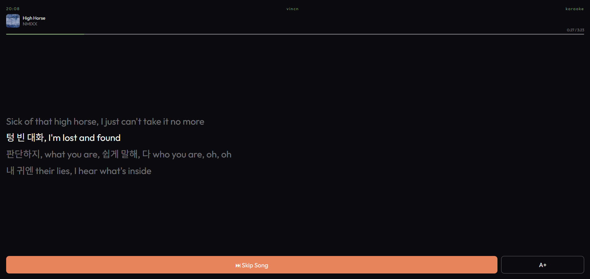

# Car Karaoke
A car-dashboard app that shows real-time, synced lyrics for whatever's currently playing on Spotify.

https://cha-norae.vercel.app/

**NOTE**: Website only works for authorized users due to API limitations, you will need to host and implement Spotify API yourself if you want to use this.

## About
Using Spotify's Web App API, it polls the currently playing song and searches for the associated lyrics via LRCLIB. If available, the app uses the lyric timestamps to support synced lyric scrolling.
While the Spotify app also supports lyrics, the database is not as large and the display is not easily readable. The Spotify App does allow for Fullscreen lyric display, but it disappears after every song--making it difficult to use while driving.


## Features
- **Live track polling**: Polls for a new song every 8 seconds
- **Synced and unsynced lyric support** via LRCLIB, includes instrumental and 404-no-lyrics-available states.
- **Real-time lyric highlighting** for synced lyrics using `requestAnimationFrame`, decoupled from live track polling that also allows for lyric drift prevention.
- **Skip song, adjustable font size** buttons, that are enlarged for easy usage.
- **Spotify OAuth (Authorization Code Flow)** with CSRF protection via a `state` parameter
- **Keyed multi-user storage** - refresh tokens are stored per Spotify user ID in `localStorage`, with silent reconnect on page reload so a returning user never has to re-authenticate
- **Reactive token refresh** - access tokens refresh on-demand when a request returns 401, rather than on a fixed timer

## How to Host
The tech stack/architecture is built using serverless functions that allows for hosting on sites like Vercel.

1. Create a Spotify app in the Spotify Developer Dashboard.
2. Set your redirect URI in the dashboard settings to match your deployed domain. THIS MUST MATCH.
3. Deploy to Vercel, setting the following environmental variables:
   
| Variable | Value |
|---|---|
| `SPOTIFY_CLIENT_ID` | From your Spotify app |
| `SPOTIFY_CLIENT_SECRET` | From your Spotify app |
| `VITE_SPOTIFY_CLIENT_ID` | Same as `SPOTIFY_CLIENT_ID` |
| `REDIRECT_URI` | Your exact redirect URI from step 2 |

## Local Development
```bash
npm install -g vercel
vercel dev
```
